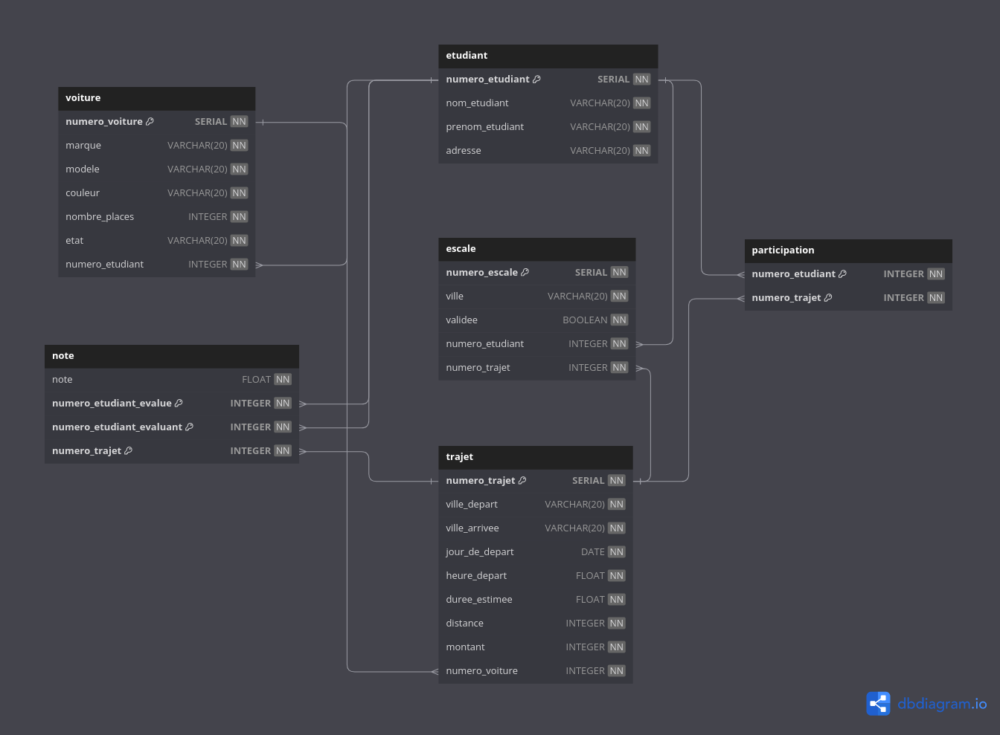

# Campus Carpooling Project

## Introduction

This will details the design and use of the database for the MIRC COVOITURAGE application, which aims to simplify the organization of shared rides among students. It covers data modeling, relational schema, implementation details, and usage instructions.

## Data Modeling

The data modeling for the COVOITURAGE application revolves around key entities such as "Étudiant" (Student), "Voiture" (Car), and "Trajet" (Trip). This is a diagram of the conceptual schema:

### Conceptual Schema

The conceptual schema served as the basis for discussions and aided in the development of the relational schema. It represented the relationships between entities and guided the implementation decisions.

### Relational Schema

The final relational schema was derived from the conceptual schema, with adjustments made during development to address challenges and inconsistencies. Changes in cardinalities and the addition of attributes were made for better representation and efficiency.

## Implementation

The project's implementation involved the use of ElephantSQL as the database solution, chosen for its ease of management and collaboration capabilities. JavaScript was used for both server-side and client-side development, with Node.js and Express.js for the backend.

### Database Calls

To enhance code clarity, SQL queries were separated from the code, and views or functions were added to the database as needed. This separation allows for easy modification of queries without altering the codebase.

### Features

The web application offers features such as consultation, statistics, update, and deletion. These functionalities are accessible based on user roles (connected or not) to ensure data consistency and security. It's also conatain an Admin page to erase the database and reinitialize it and make tests.

## Usage

Node.js and Express.js were chosen for both backend and frontend development to maintain code consistency.

## Verification

Triggers were implemented to maintain data consistency in the database. Examples include triggers to ensure that a car associated with a trip is in good condition and to prevent the addition of an unvalidated stop in a trip.

## Note on Hosting

The project was hosted on the Azurewebsites platform, chosen for its support of Node.js. The database was hosted on ElephantSQL, which offers a free tier for small projects. The project was deployed on Azurewebsites using GitHub Actions, which allows for automatic deployment on every push to the main branch.

## Conclusion

In conclusion, the COVOITURAGE database management project successfully implemented a platform for managing campus carpooling. It utilized JavaScript for both server and client sides, HTML, and CSS for the frontend, and SQL for database interactions. The project adhered to conceptual and relational schema constraints while offering various functionalities for data manipulation and retrieval.
