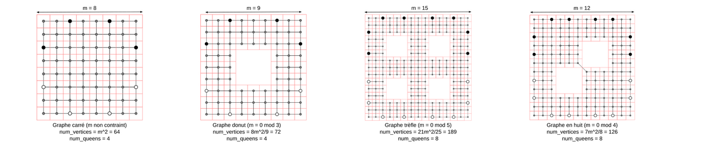
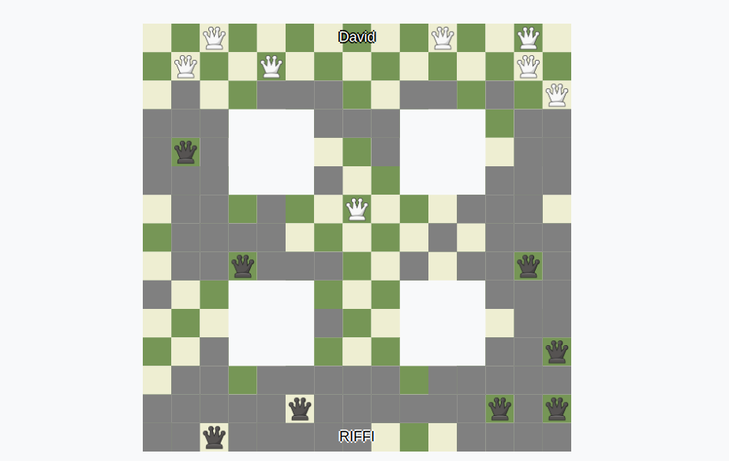

  # Amazon Game

  GitHub: [Amazon Game](https://github.com/Bugz-gg/amazons_game)

  ## Overview
  The Amazon Game is a territorial battle between two players, each striving to preserve their mobility while restricting their opponent's. Traditionally played on a chessboard, players command a set number of Amazons. A turn consists of moving one piece and firing an arrow onto a vacant square, rendering it inaccessible. The complexity of the game is highlighted by the representation of inaccessible squares as walls.
  We based our project on this game, we had to do a serveur and 2 bots to play against each other. The purpose was to compete against other teams and see who had the best bot. We done it in C and implement heuristics to make our bot more efficient.

  ## Key Features
  -**Server:** The server is the one who manage the game, he send the board to the bots and receive the moves from them. He also check if the moves are valid and if the game is over.

  -**Bots:** The bots are the players, they receive the board from the server and send back the move they want to do. They are doing their best move according to their heuristics.

  -**GSL Matrix:** We used GSL Matrix to represent the board and the moves, it's a library that allow us to do matrix operations easily. We endled different type of grids

  ## Final Result
  This is the final result of the game. This exemple is a game between our bot and the bot of another team (We won) in an clover grid :

  

