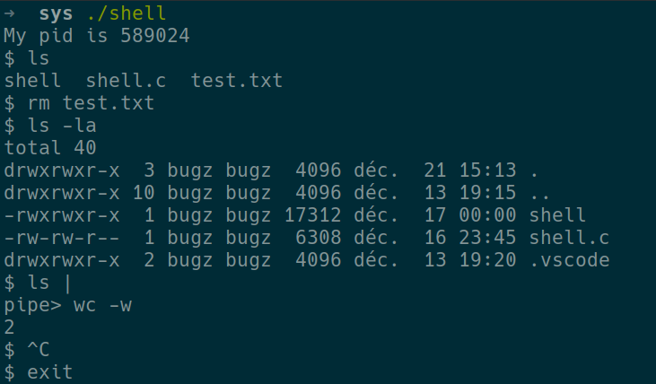

## Description
  Using the system calls such as fork, exec, wait, dup2, pipe, etc. I created a shell that allow us to execute commands and use pipes.
  That looks like this:
  
  The shell is ignoring SIGINT signal, but not child processus and it's closing when we type exit.
